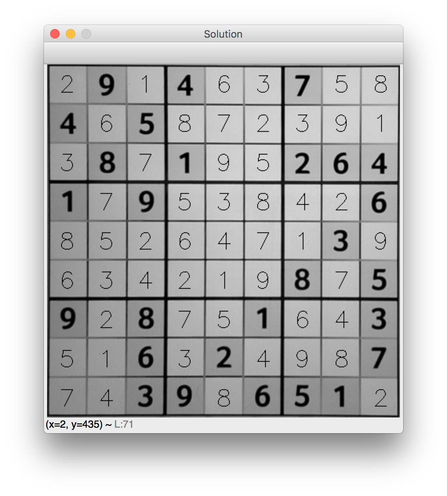

# Sudoku Solver

Stuck on a sudoku? Use your webcam to take a picture and get the solution right away! 

## Install
Clone this repo
```shell
git clone https://github.com/erickque/sudoku-solver.git
cd sudoku-solver
```
Install dependencies
```shell
pip install -r requirements.txt
```

## Usage
```shell
python3 main.py
```

A webcam capture window open. Place the sudoku puzzle in front of the camera and try to have it fill most of the window. Press the spacebar to take a picture. A window containing the solution will then appear. Press esc to quit. 

## Example


